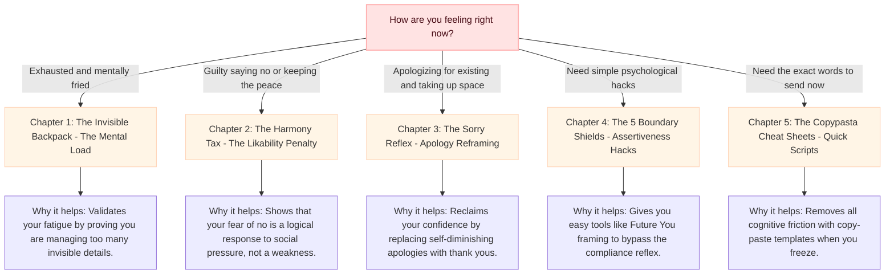

# The Sisterly Guide to Boundaries & Reclaiming Your Space 💖

If you’ve been feeling completely exhausted lately—even on days when you didn't do anything physical—take a deep breath. You are not lazy, you are not failing, and you are definitely not crazy. 

You are carrying what psychologists call the **"Mental Load"** (cognitive labor). It is a heavy, invisible backpack that women are conditioned to wear from a young age. 

This guide is your roadmap to unpacking that backpack, reclaiming your peace, and setting boundaries without feeling like a bad person. Let's get into the science and the exact words you can use starting today.

---

## 🗺️ How to Use This Guide: Your Navigation Map

Find how you are feeling in the map below, and jump straight to the section that has the antidote.

---

## 🎒 Chapter 1: The Invisible Backpack (Understanding the Mental Load)

Have you ever felt like you're the "operations manager" of your life, your home, or your office? Even if others help with chores, you’re still the one who has to plan, remind, and follow up. That is the **Mental Load**, and it's backed by science:

### 1. The "Thinking and Worrying" Gap
> [!NOTE]
> **The Science:** Sociologist Susan Walzer discovered that even when couples split physical chores 50/50, women do almost all the cognitive work—like worrying about developmental milestones, researching solutions, and coordinating schedules.
* **What this means for you:** Physical chores are visible (like taking out the trash). But the *thinking* work is invisible. If you are the one who has to remember that the dog is low on food, add it to the grocery list, search for the best price, and make sure it's bought—that is labor. Your brain is running a 24/7 spreadsheet, and that is why you feel mentally fried.

### 2. The 4 Stages of a Chore
> [!NOTE]
> **The Science:** Researcher Allison Daminger (2019) broke down domestic tasks into 4 distinct phases:
> 1. **Anticipating:** Realizing a need exists (e.g., *"We're going to need a gift for Sarah's birthday next week"*).
> 2. **Identifying Options:** Finding choices (e.g., *"Here are three cool gift ideas"*).
> 3. **Deciding:** Making a choice (e.g., *"Let's buy the second one"*).
> 4. **Monitoring:** Making sure it happens (e.g., *"Did it ship? Is it wrapped? Did we sign the card?"*).
* **What this means for you:** Daminger found that women do almost all the **Anticipating**, **Identifying**, and **Monitoring**. Partners usually only step in for the **Deciding** part. 
* **The Trap:** Because deciding is collaborative, it *feels* equal. But you did all the prep work and you have to do all the follow-up. That’s why you feel like you have to delegate everything, which is a job in itself!

### 3. The CPE Framework (Conception, Planning, Execution)
> [!IMPORTANT]
> **The Science:** In *Fair Play*, author Eve Rodsky argues that dividing chores by task splitting (e.g., one partner planning the groceries and the other buying them) doesn't solve burnout. To free yourself from the mental load, a task must have a single owner who handles **Conception** (noticing the need), **Planning** (organizing the timeline and details), and **Execution** (completing the task). 
* **What this means for you:** If your partner says, *"Just tell me what to do and I'll do it,"* they are taking execution but leaving the conception and planning stages on your plate. You are still acting as their manager.

> [!TIP]
> **Bestie Check-In 💬**
> *Think about your week: Are you executing tasks, or are you managing them? Send a screenshot of this section to a friend and ask: "Is your mental spreadsheet running 24/7 too?"*

---

## ⚖️ Chapter 2: The Harmony Tax (Why Saying "No" is Terrifying)

When a coworker asks you to take on "one quick task" or a friend asks you to go to an event you have zero energy for, why does saying "no" make your stomach drop? 

### 1. The "Likability Penalty" & Backlash
> [!WARNING]
> **The Science:** Psychologists Williams & Tiedens (2015) confirmed that women face a **"backlash effect"** (or likability penalty). We are socially conditioned to be "communal" (warm, nurturing, helpful). When we act assertively or say a firm "no," it violates that social script, and people may subconsciously label us as "cold," "difficult," or "selfish."
* **What this means for you:** Your anxiety about saying "no" isn't a weakness—it's a highly logical fear of social backlash. You have been conditioned to think that keeping the peace is your job, even if it destroys your own peace.

### 2. The "Self-Advocacy" Trap
> [!IMPORTANT]
> **The Science:** A study by Amanatullah & Morris (2010) found that women negotiate beautifully and feel zero anxiety when they are advocating for *someone else*. But the second they have to advocate for *themselves* (like saying no to protect their own time or asking for a raise), their anxiety spikes because they anticipate social backlash.
* **What this means for you:** You are probably a fierce defender of your friends, your family, or your pets. But you treat yourself like a second-class citizen. 

### 3. Emotional Labor & Mood Regulating
> [!NOTE]
> **The Science:** Sociologist Dr. Arlie Hochschild coined the term **"Emotional Labor"** in *The Managed Heart* (1983). It describes the energy spent managing and adjusting your emotions to keep the people around you comfortable and happy. 
* **What this means for you:** You might find yourself constantly monitoring the mood in the room, trying to make sure no one is upset, uncomfortable, or angry. When you set a boundary, and the other person has a negative reaction, your social conditioning makes you want to immediately apologize and drop your boundary to make them happy again.

> [!TIP]
> **Bestie Check-In 💬**
> *Remember: You can care about people without being constantly available. A boundary is not an attack; it is information.*

---

## 🗣️ Chapter 3: The Sorry Reflex (Why We Apologize for Existing)

Have you ever noticed how often you say the word "sorry"? You say it when someone bumps into *you*, when you ask a question in a meeting, or when you take more than five minutes to reply to a text.

### 🔬 The Science
A study in *Psychological Science* by Karina Schumann and Michael Ross (2010) looked at the "apology gap" between men and women. They found that women apologize significantly more than men—but not because women are naturally more submissive. 

Instead, **women have a much lower threshold for what they consider a relational "offense."** We perceive minor inconveniences (like asking for help or taking up space) as relationship disruptions that require a social repair (an apology).

### 💬 What This Actually Means for You
When you constantly say *"sorry,"* you are subconsciously telling your brain—and the person you are talking to—that you have done something wrong, even when you haven't. This chips away at your confidence and authority.

To break this, use **Symbolic Recovery**: replacing "Sorry" with "Thank you." This shifts the dynamic from you begging for forgiveness to you showing appreciation, which projects competence while maintaining warmth.

| ❌ Instead of saying... | ⿠ Say this instead... |
| :--- | :--- |
| *"Sorry for the late reply!"* (Implies: *I messed up.*) | *"Thank you for your patience on this!"* (Implies: *You are patient.*) |
| *"Sorry to bother you with a question."* (Implies: *I am a nuisance.*) | *"Thank you for taking the time to share your thoughts on this."* |
| *"Sorry for taking up your time."* | *"Thank you for helping me work through this."* |
| *"Sorry, I have to go now."* | *"Thank you for the great chat, I need to run!"* |

> [!TIP]
> **Bestie Check-In 💬**
> *Try this with your friends today. If one of you apologizes unnecessarily, respond with: "No sorries here! What are we thanking each other for instead?"*

---

## 🛡️ Chapter 4: The 5 Boundary Shields (Psychological Hacks)

We can’t change society overnight, but we *can* use psychological hacks to protect our peace while keeping our relationships intact.

### Shield 1: Advocate for "Future You"
Since science shows you’re a natural at defending others, stop thinking of the boundary as defending "present you." Instead, picture **"Future You"** tomorrow night—exhausted, stressed, and crying. Say "no" to protect *her*. She deserves a protector, and that protector is you.

### Shield 2: Use the "Framing Statement" (Soft Cushion First)
> [!TIP]
> **The Science:** Research by VitalSmarts shows that when women use a **"framing statement"** before setting a boundary (explaining their positive intent first), social backlash drops by **27%**. 
* **Instead of just saying:** *"I can't do this project."*  
* **Use a frame:** *"I want to make sure I deliver high-quality work on my current projects, so I won't be able to take this new one on right now."* (This frames your "no" as a commitment to quality, not laziness!)

### Shield 3: "I Don't" vs. "I Can't"
> [!TIP]
> **The Science:** A study by Vanessa Patrick & Henrik Hagtvedt (2012) proved that using *"I don't"* signals a firm, identity-based choice, whereas *"I can't"* implies an external restriction that invites negotiation and pushback.
* **Instead of:** *"I can't answer emails after 7 PM tonight because I'm busy."* (They will think: *“Okay, but what about tomorrow night?”*)
* **Say:** *"I don't check emails after 7 PM."* (This is just your rule. They have to adjust.)

### Shield 4: The "Check My Bandwidth" Buffer
When someone asks you for a favor, your brain's social conditioning defaults to an immediate "Yes!" to maintain safety. 
* **The Hack:** Give your nervous system a buffer. Never say "yes" on the spot. Always say: *"Let me look at my calendar/workload and get back to you by [specific time/tomorrow]."* This breaks the automatic compliance reflex.

### Shield 5: The "Broken Record" Technique
> [!NOTE]
> **The Science:** Popularized by psychologist Manuel J. Smith (*When I Say No, I Feel Guilty*, 1975), this technique involves repeating your boundary statement calmly and consistently, without offering new explanations.
* **Why it works:** When you offer new excuses (e.g., *"I can't come because I don't have a ride, and I have to study..."*), you give the other person "hooks" to negotiate with you (e.g., *"I can drive you! And you can study at my house!"*). Simply repeat your core statement calmly: *"I'd love to go, but I don't have the capacity this weekend."*

---

## 🛠️ Chapter 5: The Copypasta Cheat Sheets (Quick Scripts)

Here are ready-to-use, socially engineered, and psychologically backed scripts. Tweak the details in brackets and send!

### 1. Work & Career Boundaries 💼

#### Pushing Back on Scope Creep (The "Quality Shield")
> *"I’d love to help with this, but my plate is currently full with [Project A] and [Project B]. To make sure I maintain the quality of those projects, I won't be able to take this on right now. If it's a priority, should we deprioritize one of my other tasks to make room?"*

#### Coworker Hand-Offs
> *"I am focused on my own deadlines today, so I am not available to cover this. I can answer one specific question, but I cannot own the task."*

#### Email Out-of-Hours Auto-Responder
> *"Thank you for your message. My working hours are [Time Range] [Days]. I will respond to emails received outside these hours on the next business day. For urgent matters, please contact [Alternative Contact]."*

#### Salary Negotiation (The Market Frame)
> *"Based on my research, the market range for this role with my experience level is [Range]. I'm excited about the opportunity and confident I can deliver significant value. I'd like to discuss compensation in the [upper end of range] to reflect that."*

#### Handling Workplace Interruptions
> *"I'd like to finish my point—I'll hand it over to you in just a moment."*

---

### 2. Social & Friendship Boundaries 🎈

#### Declining a Social Invite (The "Energy Recharge")
> *"I’m so grateful you invited me, and I would love to catch up! I’ve had a really intense week and need to use this weekend to recharge my battery, so I won't be able to make it. Let's definitely grab coffee/lunch next week when I'm back to 100%!"*

#### Friend Wants a Heavy Conversation (Emotional Buffer)
> *"I care about you so much and want to give you the support you deserve, but I’m currently feeling pretty emotionally overwhelmed myself and don't check in on deep conversations when my own battery is empty. Can we talk about this on [day/time] when I have more bandwidth to focus on you?"*

#### Redirecting the "Therapist" Role
> *"I love you and I want to support you, but I think talking to a professional might be more helpful than what I can offer. Can I help you find someone?"*

---

### 3. Family & Partner Boundaries 🏡

#### Delegating to a Partner (The CPE Ownership Shift)
> *"Hey, my mental bandwidth is completely maxed out this week. I need you to take full ownership of dinner on Wednesday and Thursday. That means planning what we're eating, checking the ingredients, buying what's missing, and making it. I don't want to think about it at all. Can I leave that card in your hands?"*

#### Last-Minute Family Requests
> *"I cannot rearrange my day on short notice. Please ask me earlier next time."*

#### Guilt-Tripping Family Members (The "Loving Limit")
> *"I love you guys so much, and because I love you, I want to make sure when we hang out, I am fully present and not a stressed-out mess. My schedule is completely overwhelmed right now, so I don't do weekend visits when my capacity is this low. Let's schedule a call/visit on [specific day] instead so I can focus on you properly!"*

#### Managing In-Laws (The United Front)
* **To your partner first:** *"I love your family, but I need us to set a limit on [visiting times/unannounced calls]. Let's agree on [agreed boundary], and can you deliver it as our joint decision?"*
* **The Joint Message to In-Laws:** *"We love spending time with you! To make sure we're keeping up with our own house chores and rest, we've decided to set aside [specific days/times] for family visits. We won't host this weekend, but we're so excited to see you next [agreed day]!"*

---

### 4. Personal & Medical Autonomy 🩺

#### Self-Advocacy in Medical Settings (Pushing Back on Dismissal)
> *"I understand you may think this is [condition], but I know my body and this feels different. I'd like [specific test/referral]. If we are not doing it, can you please document in my chart that I requested it and the reason it was declined?"*

#### Bodily Autonomy / Consent
> *"I'm not comfortable with that right now. I'd like to [alternative]."*

---

### 5. Money & Budget Boundaries 💸

#### Decline Lending Money
> *"I care about you, but I am not in a position to lend money right now. I hope you understand."*

#### When a Group Plan is Too Expensive
> *"That sounds fun, but it is outside my budget right now. I am keeping my spending lower this month, so I cannot join for [event/trip/dinner]. Let's do something simpler another time!"*

#### Splitting the Bill Fairly
> *"I am happy to pay for what I ordered, but I am not comfortable splitting the full bill evenly this time. I planned for my portion, so I am going to cover my own order separately."*

---

## 🧠 Chapter 6: Cognitive Reframing & Self-Compassion Exercises

Use these exercises when the guilt starts creeping in:

### 1. The Gender-Check Reframe
Whenever you feel guilty for saying "no," ask yourself:
> *"Would a guy feel guilty for setting this exact same boundary?"*
If the answer is no, the guilt isn't moral feedback—it is internalized gendered socialization. Swap the guilt with: **"Setting this boundary is an act of self-respect, not selfishness."**

### 2. Kristen Neff's Hand-on-Heart Self-Compassion Practice
When the guilt is intense:
1. Place your hand on your heart (or wrap your arms around yourself in a hug).
2. Breathe deeply and say to yourself:
   > *"This is a moment of stress. Guilt is normal when breaking old people-pleasing habits. Many women feel this exact same way. I am allowed to protect my peace. May I be kind to myself."*

---

## ⿠ Chapter 7: The "Emergency Card" (One-Line Shields)

Save these on your phone for moments you freeze or have decision fatigue:

*   *"I don't have the capacity for that right now."*
*   *"Let me check my schedule and get back to you."*
*   *"I need to think about that before committing."*
*   *"I can help with [Part A], but [Part B] is outside my bandwidth."*
*   *"I'm keeping that boundary."*
*   *"My answer is still no."*
*   *"That doesn't work for me, but I hope you have a great time!"*

---

> Remember: **A "no" to someone else is a "yes" to yourself.** You cannot pour from an empty cup, and you don't need to justify your rest. You've got this! 💪✨
