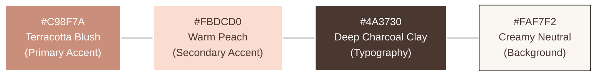
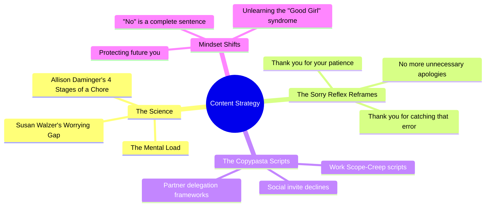

# Instagram Profile Setup: "Hey Sis" Boundaries & Self-Care 💖

Use this guide to set up a premium, conversion-oriented Instagram page to promote the **Boundary Script Toolkit**. 

---

## 1. Brand Identity & Username Ideas

Choose a username that is short, easy to remember, and friendly.

| Username Option | Vibe |
| :--- | :--- |
| **`@heysis.co`** | Clean, modern, community-oriented. |
| **`@heysis.boundaries`** | High-intent, keyword-rich. |
| **`@theboundarybible`** | Authority-building, resource-focused. |
| **`@mentalloadclub`** | Community-driven, highly relatable. |
| **`@protectyourpeace.co`** | Aspirational and peaceful. |

---

## 2. Optimized Bio Options (Built for Conversion)

Your bio has one job: make a visiting user say *"OMG, this is exactly what I need,"* and click the link.

### Option A: The "Friendly Sis" (Recommended)
> **Name:** Hey Sis \| Boundary & Peace Tips 💖  
> **Category:** Mental Health Service  
> 🎒 Carrying the heavy "mental load" of everyone else?  
> 🛡️ Reclaim your time, energy & peace.  
> ✨ Scripts, grounding cards & mini-kits for hard conversations.  
> 👇 Get the Boundary Script Toolkit ($9.99 Launch Offer)  
> *[your_linktree_or_website]*  

### Option B: The "Empowered Woman" 
> **Name:** Hey Sis \| Reclaim Your Space  
> **Category:** Product/Service  
> 🧠 Your brain isn’t meant to run a 24/7 spreadsheet.  
> 🕊️ Ditch the "Good Girl" anxiety & people-pleasing.  
> 💬 Exactly what to say to bosses, partners, & in-laws.  
> 🎁 Boundary Script Toolkit ($9.99 Launch Offer) 👇  
> *[your_linktree_or_website]*  

---

## 3. Visual Identity & Brand Aesthetics

Based on the generated profile picture, here is your high-end, cohesive color palette:

* **Typography Style:** 
  * **Headers:** Elegant, clean Serif fonts (e.g., *Cormorant Garamond* or *Ogg*).
  * **Body Text:** Modern, readable Sans-Serif (e.g., *Inter* or *Montserrat*).

---

## 4. Feed & Content Strategy (The 4 Pillars)

To drive traffic to your digital boundary toolkit, structure your posts around these core pillars:

---

---

## 5. Launch Post Ideas (Reels & Carousels)

### Post 1: "The 4 Stages of a Chore" (Educational Carousel)
* **Slide 1 Title (Big, bold typography):** *"Why are you so exhausted when you didn't do any physical work today?"*
* **Slide 2:** Explain the difference between *doing* a chore and *planning* a chore (Anticipating, Identifying, Deciding, Monitoring).
* **Slide 3:** Share the stats showing women carry 80% of stages 1, 2, and 4.
* **Slide 4:** *"You aren't tired because you're weak. You are tired because your brain is running a 24/7 project management spreadsheet for free."*
* **Slide 5 (Call to Action):** *"Need help delegating? Grab our copy-paste scripts in the bio to shift the load."*

### Post 1B: "Open this when your hands are shaking" (Premium Product Preview)
* **Slide 1 Title:** *"When you know you need a boundary but your mind goes blank..."*
* **Slide 2:** Preview the Start Here roadmap: pick the situation, choose the tone, copy one script, save the pushback reply.
* **Slide 3:** Preview the Frozen Protocol: pause, delay, answer after your nervous system settles.
* **Slide 4:** Show the printable grounding cards, money mini-kit, and digital boundary mini-kit.
* **Slide 5 (Call to Action):** *"Get the Boundary Script Toolkit so the words are ready before the hard conversation happens."*

### Post 2: "Text this to decline a weekend invite" (Practical Reel)
* **Visual:** A clean, aesthetic video of you making a matcha or walking in the park, with text on screen showing a real-life text conversation.
* **Text on Screen:** 
  * *The Push:* *"Hey! You're coming to the party tonight right? Everyone is asking for you!"*
  * *The Sisterly Response:* *"I’m so grateful you invited me, and I would love to catch up! I’ve had a really intense week and need to use this weekend to recharge my battery, so I won't be able to make it. Let's definitely grab coffee/lunch next week when I'm back to 100%! 💖"*
* **Caption:** *"Stop making up fake excuses or saying 'maybe' when you want to say 'no.' Save this script and protect your weekend rest!"*

---

## 6. Brand Description & Launch Copy

### Official Brand Description (For website/about us)
> **Hey Sis** is a digital sanctuary and toolkit designed for the modern woman who is tired of carrying the invisible mental load. We combine research-backed boundary principles with warm, sister-to-sister guidance, copy-paste scripts, printable grounding cards, and mini-kits for money, work, family, dating, and digital boundaries. The goal is simple: give women useful words before the hard conversation happens.

### Instagram Launch Post Caption (Ready to Copy & Paste)
> **Hey sis, we need to talk about that heavy, invisible backpack you’ve been carrying. 🎒💖**
> 
> Ever find yourself mentally scheduling, planning, worrying, and managing everyone’s lives around you—only to feel completely fried by the end of the day? 
> 
> That’s called the **Mental Load** (or cognitive labor), and science proves women carry almost all of it. We are conditioned to be the organizers, the peacekeepers, and the people-pleasers. We say "sorry" for taking up space, and saying "no" makes our stomach drop. 
> 
> **But here is the truth:** You cannot pour from an empty cup, and you are not a project manager for free. 🕊️
> 
> That’s why we created **Hey Sis**. We are here to bring you the science of why you’re so tired, combined with the exact, copy-paste scripts, grounding cards, and mini-kits you need to set boundaries with bosses, partners, in-laws, and demanding friends—without sounding aggressive or feeling guilty.
> 
> ✨ **No more over-explaining. No more fake excuses. Just clear, loving boundaries.**
> 
> 👉 Hit **Follow** to join the club, and click the link in our bio to grab your **Boundary Script Toolkit** today! 
> 
> *#MentalLoad #Boundaries #SelfCareForWomen #PeoplePleaser #ReclaimYourPeace #HeySis #WomenEmpowerment #MentalWellbeing #SayNoWithoutGuilt*

---

> 💡 **Tip:** Use your generated profile picture `insta_profile_pic.png` as the main account image to instantly establish this warm, high-end, trustworthy aesthetic!
